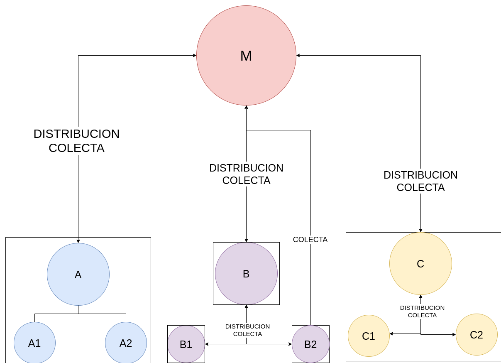

# Getting Started

This Next.js app uses API Routes to create a Graphql endpoint using TypeGraphql. It uses a MongoDB as database and moongose as object modeling.

## Configuration

### Step 1. Get the connection string of your MongoDB server

In the case of MongoDB Atlas, it should be a string like this:

```text
mongodb+srv://<username>:<password>@my-project-abc123.mongodb.net/test?retryWrites=true&w=majority
```

### Step 2.  Run Next.js in development mode

```bash
yarn install
yarn dev
```

### Step 3.  Run the GraphQL playground

Open [http://localhost:3000/api/graphql](http://localhost:3000) with your browser to see the result.

## Project Description

The application models a product logistics and sales system with two services (distribution and collection).

There is a parent warehouse that is responsible for distributing to its N branches, which in turn have their own distribution network; if we require diagramming, we would have a tree structure.

Each member of the first level of the tree (matrix branches) has its own work dynamics which can be in the three ways shown in the following figure:



By construction, the system is limited to obtaining certain information reports. For each type of branch, the reporting system is limited to:

* Type A: Number of products sold can be retrieved, impossible to obtain the location of the products, how many have been sold and where.

* Type B: Since each branch is an extension in every sense of the parent network and the debt of the products corresponds individually to each node of the redistribution network, the information at the next level of the redistribution network of the type branch B, can be fully recovered. You only have to be careful not to duplicate collection information in cases where the payment is made directly to the parent company.

* Type C: Information about the location of the products can be retrieved at any time, but since the system keeps only the charges at the branch level and the charges are handled with the products sold, in many cases, the information particular about how many were sold and where at the redistribution level it is lost (at the level of the redistribution network), being kept only at the branch level and being difficult to recover.

As mentioned above, the characteristics of type B branches that allow payments to be made both directly to the parent node and to the parent node can cause problems. When implementing a feature that allows collections to be made through the parent node and directly to the matrix, once the payment of the debt is made through a method, the necessary tr must be carried out so that if the other method is executed, the information is up to date.

When considering the debts for products sold, outdated information about the stock is shown, since the stock is not updated until the collection of the debts is made.

During system design, guiding the design based on the functionalities required by our client and building an optimal software solution for it is not always the best option. It is very difficult to initially list all the functionalities required by the system, either not all of them are initially expressed or they are not communicated correctly, and even if all of them are listed and communicated, the nature of the business may require changes. Responding quickly to these changes gives our customers a competitive advantage and building software coupled with specific functionalities is increasingly difficult to change.

Once the initial functional requirements are understood, instead of designing the software for them, we must focus on understanding the expected behaviors of the system and designing software that allows those behaviors, in this way we can adjust the system to the current requirements. The requirements can change, but a well-identified general behavior hardly changes, so if the system accepts it, we can quickly adjust it to the new requirements.

In this system we can identify two expected behaviors:

* Distribution: Products are shipped from one warehouse to another.
* Collection: Debts are collected from one store to another.

We see how these general behaviors can be used to model the 3 different use cases required by the client. So our first objective should be that the system accepts this behavior, in this way the following developments can adapt the system to the required functionalities quickly and without coupling, allowing any future modifications to the functionalities.
